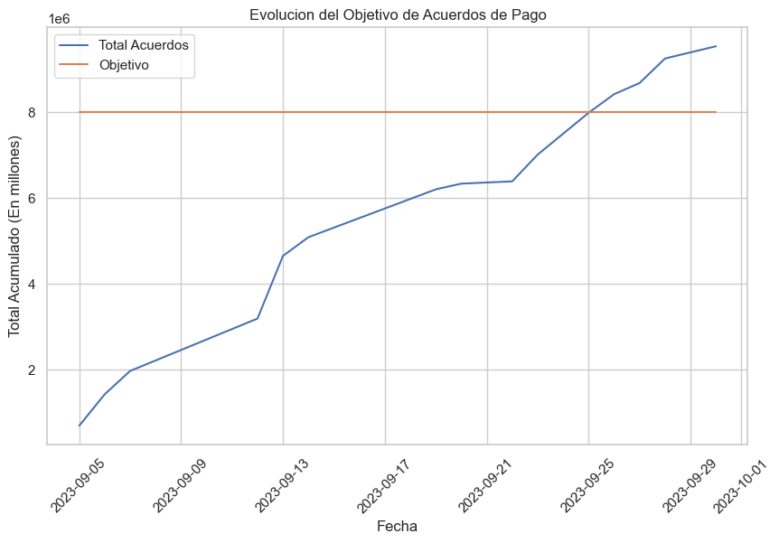
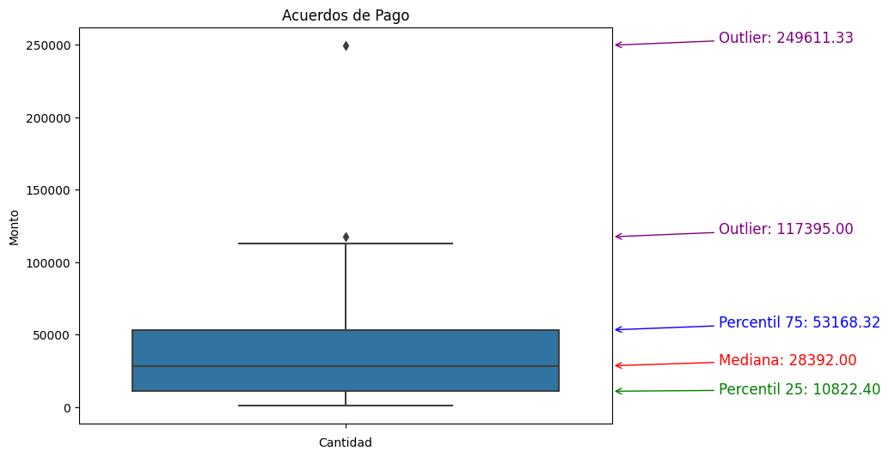
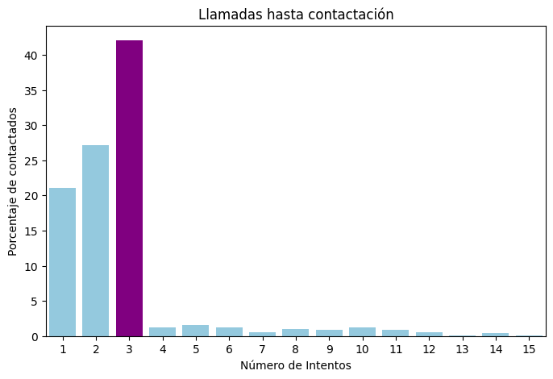
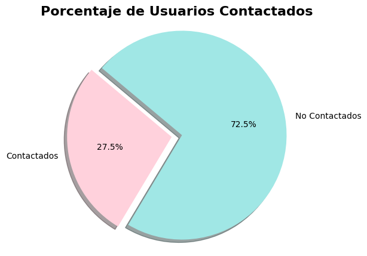
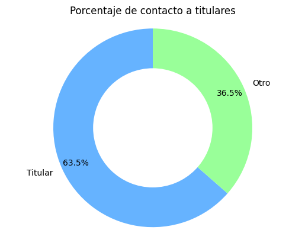
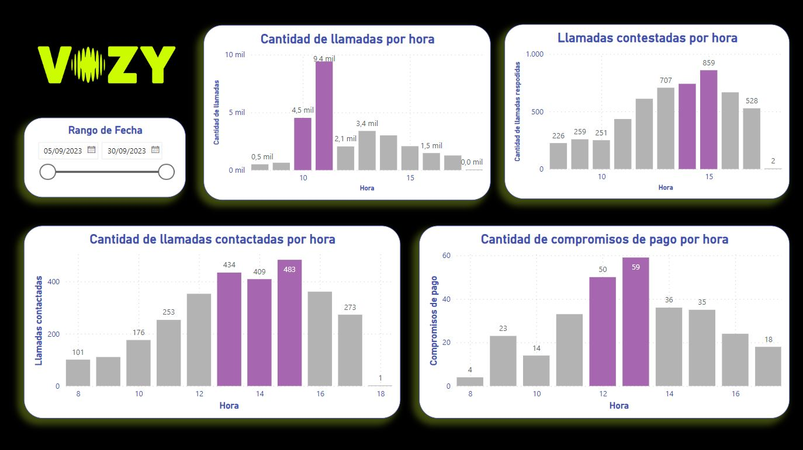
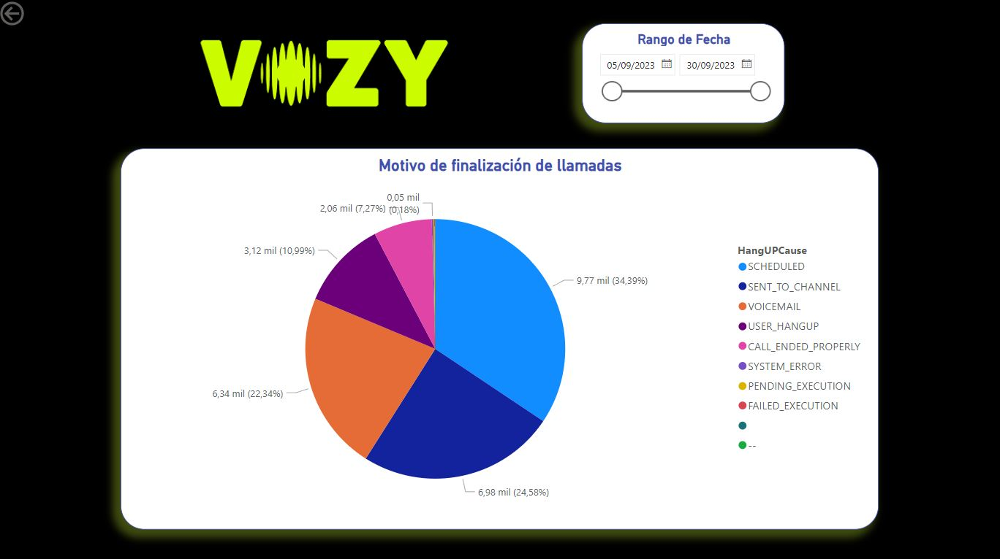
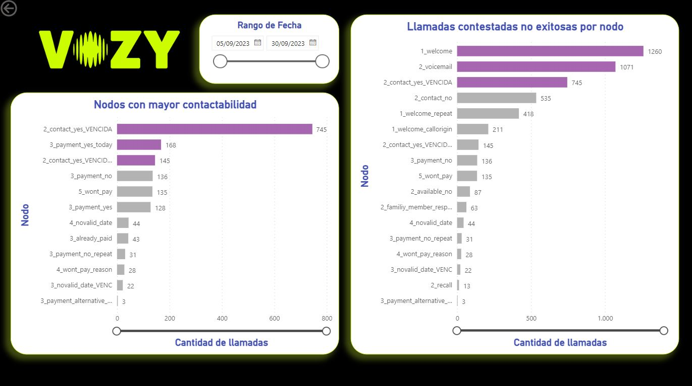
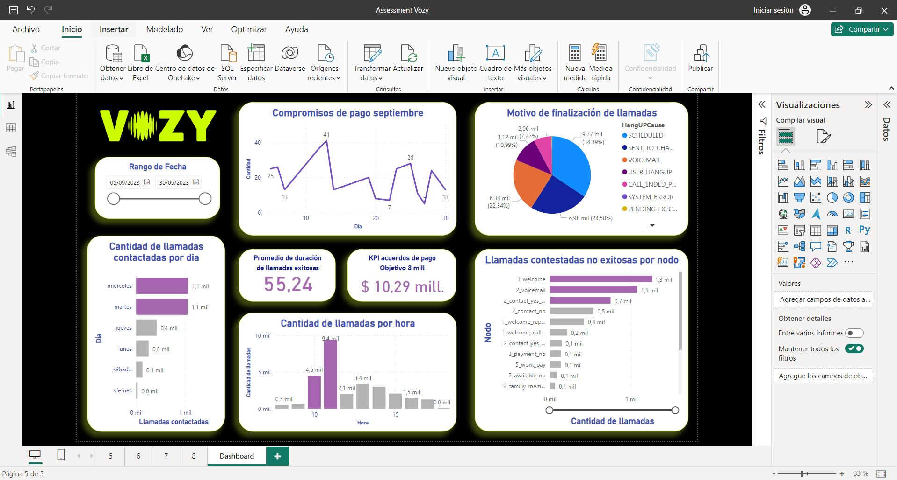

# Assessment CS OPS - Vozy

## Introducción

Este Assessment se enfoca en el análisis de datos de gestión de cobranza para un Cliente X, una empresa que busca cumplir con sus objetivos de acuerdos de pago y contestación de llamadas durante el mes de septiembre de 2023. 
El objetivo principal del proyecto es proporcionar información valiosa y recomendaciones basadas en datos para ayudar al equipo de Customer Success a mejorar el rendimiento y la eficacia de sus operaciones de cobranza.

## Datos

En este proyecto, utilizo un conjunto de datos de un cliente X de la plataforma Vozy, que contiene información detallada sobre las llamadas de cobranza realizadas. Se puede acceder al archivo de datos desde el siguiente enlace:

[Descargar Archivo de Datos](https://file.notion.so/f/d54ca90e-2e6a-4cfb-9169-d21dfcff7822/09134a37-19c7-4601-befd-b5ed3ea9e758/Empresa_X_Info_Septiembre_2023.xlsx?id=efc15527-c6f8-461c-ad56-e156e39dced9&table=block&spaceId=d54ca90e-2e6a-4cfb-9169-d21dfcff7822&expirationTimestamp=1698883200000&signature=R5l4qVVOC3GJn6munabN4CUtncHWo_Wls3xFY3wzrDs&downloadName=Empresa+X+Info+Septiembre+2023.xlsx)

## Preguntas del Ejercicio Práctico

### 1. El cliente X espera tener acuerdos de pago por valor de 8.000.000 de Pesos, basado en tu análisis de los datos el mes de Septiembre fue un mes en el que se cumplio el objetivo, fue bueno, malo, por que?

Durante el análisis de los datos del mes de septiembre, identifiqué un total de acuerdos de pago que alcanzaron $10,285,458.98. Sin embargo, observo que había duplicados en los registros. Esto puede atribuirse a diversos factores, como la participación de un mismo usuario en varias campañas o el incumplimiento de plazos.

Para obtener resultados más precisos, eliminé los duplicados y se conservé únicamente las propuestas más recientes que pertenecían a la misma deuda, siempre y cuando el monto fuera idéntico.

Como resultado, obtuve que en septiembre se alcanzó un total de $9,541,661.72 en acuerdos de pago. Este monto supera el objetivo establecido por el cliente, que era de $8,000,000.

En cuanto al cumplimiento del objetivo, el mes fue exitoso, ya que éste fué superado en un 19.27%.
Sin embargo para afirmar esto con mas precisión, me gustaría realizar las siguientes comparaciones:

1. Evaluar si el desempeño de septiembre es consistente con la media de acuerdos de pago a lo largo del año.

2. Comparar los resultados con septiembres de años anteriores para determinar si la mejora es sostenible.

3. Analizar cómo se compara septiembre con los otros meses del año en términos de acuerdos de pago.

[Acceso al Análisis](1.ipynb)

### 2. Cual es el valor promedio de acuerdos de pago por usuario único para el mes de septiembre?

Basado en el análisis de los datos de acuerdos de pago para el mes de septiembre, observé que el valor promedio fue de $34,696.95. 

Explorando los datos puedo observar que existen valores extremos (outliers), estos valores atípicos pueden afectar considerablemente el promedio

La mediana es una métrica que representa el valor que divide a la muestra en dos mitades iguales y  no se ve afectada por outliers. Proporciona una representación más precisa del monto de la mayoría de los acuerdos de pago, que  fué de $28,392.

[Acceso al Análisis](2.ipynb)

### 3. El cliente espera tener un 35% de contestación durante el mes de septiembre, según tu análisis cual fue el resultado de este ítem? Fue bueno o malo? y por que?

El resultado del porcentaje de contestación durante el mes de septiembre fue del 10.41%. Teniendo en cuenta el objetivo del cliente de alcanzar un 35%, este resultado puede considerarse malo.

Sin embargo este porcentaje se calcula con el número total de llamadas realizadas y las respuestas recibidas. Este cálculo puede no reflejar completamente la efectividad de las gestiones, ya que no tiene en cuenta el número de llamadas realizadas hasta lograr el contacto exitoso.

Como se puede observar en el gráfico, mas del 40% de usuarios, requirió ser llamado 3 veces para lograr la contactación.

Por este motivo consideré relevante también, evaluar el porcentaje por usuario único. Al hacerlo, obtuve una métrica que proporciona una visión más precisa de cuántos usuarios se contactaron exitosamente durante el mes de septiembre, lo que puede ser más representativo de la efectividad de las gestiones.

Por lo tanto, el porcentaje de contestación del 10.41% es bajo en comparación con el objetivo del 35%. 
Considerando la métrica alternativa, el porcentaje de contestación por usuario único fue de 27.53%. Creo que este dato da una imagen más completa de la efectividad de las llamadas.

[Acceso al Análisis](3.ipynb)

### 4. De las llamadas contestadas se espera que al menos el 50% sean titulares, cuéntanos en el mes de septiembre, según tu análisis como estuvo este resultado?

En general, el porcentaje de llamadas contestadas fue del 55.09%. Considerando el campo "contactability_type" en el que, según el diccionario de datos, "Contacto Sí" confirma que se trata de un usuario titular.

Luego incluyo registros donde la titularidad se confirma a través de la columna "contact_confirmed," en este caso, se obtiene un resultado del 56.86%.

Continuando con el enfoque en el índice de contactabilidad, se procedió a eliminar las llamadas duplicadas que podrían distorsionar los datos. Esto se debe a que en las llamadas en las que el usuario no confirma ser titular o en las que atiende otra persona, es probable que se realicen nuevos intentos de llamada en futuras campañas. 

En este escenario, el porcentaje de contactación de titulares alcanza el 63.53%.

[Acceso al Análisis](4.ipynb)

### 5. Según tu análisis, Cuales son las horas en las que mas se realizan llamadas, en las que mas se contestan llamadas y en las que hay mas efectividad?

Visualizando los datos, podemos observar que las horas en las que se realizan más llamadas son entre las 10 y las 11 a. m., alcanzando su punto máximo a las 11 a. m.

Las horas más efectivas en términos de respuesta y contactabilidad son de 13 a 15 horas. Sin embargo, la efectividad en la generación de compromisos de pago muestra su pico entre las 12 y las 13 horas.

[Acceso al Análisis](PowerBI/Assessment%20Vozy.pbix)

### 6. Cuáles son los dos días de la semana más efectivos para realizar las gestiones?

Analizando los datos, podemos visualizar que los días más efectivos en términos de cantidad de llamadas contestadas, contactaciones, cantidad de acuerdos y monto de acuerdos son los martes y los miércoles.

[Acceso al Análisis](PowerBI/Assessment%20Vozy.pbix)

### 7. Porcentualmente cuales son los motivos de cuelgue en las llamadas?

El porcentaje de los motivos de las finalizaciones de las llamadas del mes de septiembre es el siguiente:

- 34.39%: Scheduled - Llamado que no ha sido respondido y se agenda para un nuevo intento.
- 24.58%: Sent_to_Channel - Llamado sin responder.
- 22.34%: Voicemail - Finalización luego del ingreso al correo de voz.
- 10.99%: USER_HANGUP - Llamada finalizada por el usuario.
- 7.27%: CALL_ENDED_PROPERLY - Llamada finalizada correctamente.
- 0.43%: Otro.

[Acceso al Análisis](PowerBI/Assessment%20Vozy.pbix)

### 8. Cuáles son los nodos en los que están terminando las llamadas no exitosas, pero que son contestadas.

En el siguiente analisis, se identificaron los nodos en los que están terminando las llamadas no exitosas, pero que son contestadas.

Detallo los 3 con la tasa mas alta:

Nodo "1_welcome": En este nodo, un porcentaje significativo de llamadas no exitosas son contestadas. Posiblemente este sea un primer contacto.

Nodo "2_voicemail": También se observa un número considerable de llamadas no exitosas que son contestadas en este nodo. Son llamadas contestadas por el VoiceMail

Nodo "2_contact_yes_VENCIDA": Este grupo de llamadas no exitosas es posible que sea de llamados por recordatorios de vencimiento de propuestas de pago.

[Acceso al Análisis](PowerBI/Assessment%20Vozy.pbix)

## Otras Preguntas

### 1. Teniendo en cuenta tu rol, donde vas a manejar mucha data, ¿qué plataformas propondrías para el manejo de esta información y para presentar resultados de manera comprensible para el cliente y de fácil manejo?

Para la transformación y el análisis exploratorio de datos, herramientas muy potentes son Python y SQL, junto con PySpark para Big Data.

En cuanto a las visualizaciones y Business Intelligence, opciones como Power BI, Tableau, Looker y Streamlit son muy útiles para crear dashboards interactivos y KPIs que permiten a nuestros clientes seguir la evolución de sus objetivos.

En la imagen, presento un Dashboard interactivo realizado en Power BI, una herramienta con una muy buena integración a las bases de datos y una excelente interacción con el cliente.

La elección de las herramientas también depende de la cantidad y complejidad de los datos. De todos modos, estoy dispuesto a adaptarme y profundizar en el aprendizaje de la herramienta que tengamos disponible, o que nuestros clientes requieran, así como aprender nuevas.

### 2. En este momento las llamadas no están siendo ejecutadas dentro de la plataforma de Vozy, y tenemos un ticket escalado al equipo de operaciones para abordar este problema. ¿Qué acciones tomarías para priorizar este caso?

Abordar la priorización de este caso implica: 

- Entender el problema
- Colaborar con el equipo de operaciones
- Implementar soluciones temporales si es necesario y si es posible
- Identificar la causa raíz
- Tomar medidas para prevenir futuras interrupciones
- La comunicación efectiva, seguimiento y documentación

Para abordar esta situación, primero debemos comprender la magnitud y la urgencia del problema. Esto implica conocer cuántas llamadas se ven afectadas y comprender cómo impacta en nuestras operaciones y la satisfacción del cliente, así como cualquier otro problema relacionado.

Mantenerse comunicado y colaborar con el equipo de operaciones que está gestionando el ticket. Necesitamos comprender por qué las llamadas no se están ejecutando en la plataforma, si es un problema técnico, de procesos, de servicios, un error humano etc.

Categorizar la prioridad, si el problema está causando una interrupción significativa o afecta negativamente la calidad de las llamadas, debe considerarse una prioridad alta.

Si es posible, implementar una solución temporal que permita que las llamadas se realicen, como por ejemplo en otra plataforma mientras se resuelve el problema.

Abordar la causa raíz y realizar un seguimiento constante para asegurarse de que el problema se resuelva y que no vuelva a ocurrir en el futuro. También evaluar el impacto de la solución temporal y definitiva en el rendimiento

Documentar todo el proceso, desde la identificación del problema hasta la implementación de soluciones y el seguimiento. Esto sirve como referencia para futuros problemas similares.

La comunicación efectiva con el equipo y el cliente, de las soluciones temporales implementadas, las definitivas, la causa raiz del problema y el seguimiento constante durante todo el proceso, considero que son la clave para minimizar los daños colaterales. 

## Resumen

En este proyecto de evaluación de Customer Success Op, el objetivo principal fue extraer información valiosa y obtener insights que nos permitieran entender el desempeño de las operaciones de cobranza y brindar recomendaciones basadas en datos.

Los hallazgos clave del análisis incluyen:

- El mes de septiembre fue exitoso en términos de cumplir con el objetivo de acuerdos de pago establecido por el cliente.

- El valor promedio de acuerdos de pago por usuario único para el mes de septiembre fue de $28,392 pesos.

- La tasa de contestación durante el mes de septiembre fué de 27.53%, no cumplió con las expectativas del cliente.

- La proporción de llamadas contestadas por titulares durante septiembre fué de 63.53%, cumplió con el objetivo del 50%.

- Se identificaron que los días más efectivos para realizar las gestiones, son los martes y miercoes entre las 12 y las 15hs, lo que permite una mayor eficiencia en las operaciones.

- Se identificaron porcentualmente los motivos de finalización de las llamadas.

- Se identificaron los nodos de las llamadas no exitosas pero que son contestadas.

## Autor

Maximiliano Pablo Vaca Coll

[LinkedIn](https://www.linkedin.com/in/mpvacacoll/)

[GitHub](https://github.com/VacaColl18)

[Portfolio](https://vacacoll18.github.io/)

